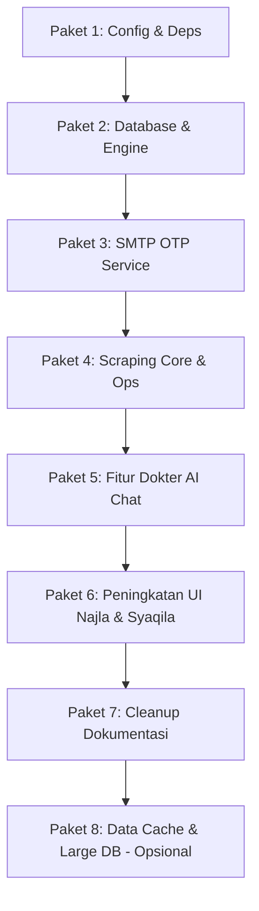

# 📑 Rencana Clustering & Strategi Push Repositori Skintify-C4

Dokumen ini disusun untuk membantu Anda melakukan **commit & push secara bertahap (incremental)** dari **75+ perubahan file** yang saat ini ada di repositori lokal Anda. 

Mengirimkan 75+ file sekaligus dalam satu *monocommit* sangat berisiko tinggi memicu **merge conflict** yang rumit jika ada anggota tim lain yang sedang bekerja di branch yang sama (`tambah_admin`). Selain itu, commit bertahap akan membuat riwayat Git tim Anda jauh lebih rapi, profesional, dan mudah untuk di-*rollback* jika terjadi kesalahan (rollback friendly).

> [!WARNING]  
> **JANGAN PUSH ATAU COMMIT SEKARANG!**  
> Dokumen ini hanya bersifat **analisis dan panduan langkah**. Ikuti panduan ini hanya ketika Anda sudah siap melakukan integrasi kode secara nyata.

---

## 🗺️ Gambaran Umum Perubahan Kode
Berdasarkan analisis `git status` dan `git diff`, perubahan kode Anda terbagi ke dalam **4 pilar utama**:
1.  **AI Chatbot Feature (Dokter AI Skintify)**: Implementasi penuh halaman konsultasi, integrasi API Gemini/Groq, sistem budget planner skincare heuristik, dan style CSS custom.
2.  **Shopee Scraper Integration**: Modul scraper baru untuk Shopee, integrasi engine database agar dapat menyimpan dan memperbarui data Shopee, serta UI pencarian marketplace yang kini mendukung 3 platform (Tokopedia, Lazada, Shopee).
3.  **UI/UX & Feature Enhancement**: Fitur "Adu Mekanik" (perbandingan wishlist dengan floating dock) pada halaman Wishlist Syaqila, dan analisis kompatibilitas jenis kulit berbasis kandungan ilmiah pada halaman Compare Najla.
4.  **SMTP OTP Email Service**: Upgrade layanan pengiriman OTP dari mode simulasi (mock) ke SMTP ril secara asinkron (`asyncio.to_thread`) agar tidak memblokir UI NiceGUI.

---

## 📦 Paket-Paket Commit & Push (Clustering)

Berikut adalah pembagian **8 Paket Push** yang direkomendasikan. Jalankan secara berurutan dari Paket 1 hingga Paket 8.



---

### 📦 Paket 1: Konfigurasi Dasar & Dependensi (Pondasi Proyek)
*   **Tujuan**: Memastikan semua environment key baru dan library pihak ketiga yang dibutuhkan sudah terpasang di komputer developer lain sebelum kode utama dijalankan.
*   **Daftar File**:
    *   `requirements.txt` (Menambahkan package baru seperti `requests` dsb.)
    *   `.env` (Konfigurasi provider AI, Gemini/Groq API keys, dan variabel baru)
*   **Perintah Git untuk Eksekusi**:
    ```bash
    git add requirements.txt .env
    git commit -m "chore: update environment variables config and dependencies"
    ```

---

### 📦 Paket 2: Pembaruan Engine & Skema Database (Database Core)
*   **Tujuan**: Menyiapkan model database dan logika penyimpanan agar mendukung platform Shopee serta optimasi pembaruan harga produk secara *live* saat scraping ulang.
*   **Daftar File**:
    *   `app/database/engine.py` (Normalisasi data Shopee & optimasi update harga di `simpan_hasil`)
    *   `app/database/database_manager.py` (Koreksi logika database)
    *   `app/database/data_manager.py` (Koreksi query database & routine utility)
*   **Perintah Git untuk Eksekusi**:
    ```bash
    git add app/database/engine.py app/database/database_manager.py app/database/data_manager.py
    git commit -m "feat(db): update database engine to support Shopee and price updates"
    ```

---

### 📦 Paket 3: Pembaruan Modul Autentikasi (OTP & SMTP Layanan Email)
*   **Tujuan**: Mengubah service OTP dari mode simulasi ke SMTP riil yang berjalan asinkron di thread terpisah agar UI NiceGUI tidak membeku (*freeze*).
*   **Daftar File**:
    *   `app/auth/auth.py` (Penerapan thread asinkron untuk OTP SMTP)
    *   `app/auth/email_service.py` (Konfigurasi detail engine SMTP)
*   **Perintah Git untuk Eksekusi**:
    ```bash
    git add app/auth/auth.py app/auth/email_service.py
    git commit -m "feat(auth): implement asynchronous SMTP email service for OTP verification"
    ```

---

### 📦 Paket 4: Modul & Skrip Scraper Baru (Shopee & Scraping Core)
*   **Tujuan**: Memasukkan modul Shopee Scraper baru, file konfigurasi kategori scraping, dan berbagai skrip operasi data (data_ops) pendukung.
*   **Daftar File**:
    *   `app/scraping/core/shopee.py` *(Untracked)*
    *   `app/scraping/core/config.py`
    *   `app/scraping/main_scraper.py`
    *   `app/scraping/scraper_manager.py`
    *   `app/scraping/sociolla_scraper.py`
    *   `app/scraping/sociolla_enricher.py`
    *   `scripts/data_ops/manual_scrape.py`
    *   `scripts/data_ops/test_shopee_live.py` *(Untracked)*
    *   `scripts/data_ops/marketplace_to_database.py`
    *   `scripts/data_ops/json_to_database.py`
    *   `scripts/data_ops/hapus_data_marketplace.py`
    *   `scripts/data_ops/merge_scraped_results.py`
    *   `data/categories_to_scrape.json` *(Untracked)*
*   **Perintah Git untuk Eksekusi**:
    ```bash
    git add app/scraping/core/shopee.py app/scraping/core/config.py app/scraping/main_scraper.py app/scraping/scraper_manager.py app/scraping/sociolla_scraper.py app/scraping/sociolla_enricher.py data/categories_to_scrape.json scripts/data_ops/
    git commit -m "feat(scrape): introduce Shopee scraper module and data operation utilities"
    ```

---

### 📦 Paket 5: Fitur Utama Dokter AI Chatbot (UI & Core AI)
*   **Tujuan**: Meluncurkan halaman konsultasi Dokter AI Skintify dengan integrasi multi-provider (Gemini/Groq/Offline Heuristic), custom chips, budget planner, serta styling CSS global.
*   **Daftar File**:
    *   `app/ui/pages/syhid/ai_chat_page.py` *(Untracked)*
    *   `app/ui/style/style.css` (Gaya global dan animasi chat bubble)
    *   `app/ui/components.py` (Navbar/sidebar update untuk menu AI Chat)
    *   `main.py` (Registrasi routing `/ai-chat` di NiceGUI)
    *   `cli.py` (Kompensasi CLI entrypoint)
*   **Perintah Git untuk Eksekusi**:
    ```bash
    git add app/ui/pages/syhid/ai_chat_page.py app/ui/style/style.css app/ui/components.py main.py cli.py
    git commit -m "feat(ui): implement Dokter AI Chatbot consultation page with Gemini and Groq API"
    ```

---

### 📦 Paket 6: Peningkatan Fitur UI Kolaboratif (Najla & Syaqila UI Updates)
*   **Tujuan**: Mengintegrasikan peningkatan fitur kosmetik & fungsional pada halaman Compare Najla (skin-type compatibility & price CTAs) dan Halaman Wishlist Syaqila (floating compare dock "Adu Mekanik"). Serta dukungan Shopee pada pencarian produk.
*   **Daftar File**:
    *   `app/ui/pages/najla/compare_page.py` (Deteksi kompatibilitas bahan aktif & badge harga live)
    *   `app/ui/pages/najla/stats_page.py` (Grafik visualisasi harga & rating)
    *   `app/ui/pages/syaqila/home_page.py`
    *   `app/ui/pages/syaqila/wishlist_page.py` (Adu mekanik comparison)
    *   `app/ui/pages/syhid/admin_page.py`
    *   `app/ui/pages/syhid/routine_page.py`
    *   `app/ui/pages/syhid/search_page.py` (Marketplace search shopee integration)
*   **Perintah Git untuk Eksekusi**:
    ```bash
    git add app/ui/pages/najla/compare_page.py app/ui/pages/najla/stats_page.py app/ui/pages/syaqila/home_page.py app/ui/pages/syaqila/wishlist_page.py app/ui/pages/syhid/admin_page.py app/ui/pages/syhid/routine_page.py app/ui/pages/syhid/search_page.py
    git commit -m "feat(ui): upgrade compare skin compatibility, wishlist adu mekanik, and shopee search integrations"
    ```

---

### 📦 Paket 7: Cleanup Dokumentasi & File Usang (Clean Up)
*   **Tujuan**: Merapikan repositori dengan menghapus file markdown lama yang usang dan memastikan folder `docs/` yang baru terlacak di Git.
*   **Daftar File**:
    *   `TUTORIAL (wajib baca, ini isinya penting banget).md` *(Deleted)*
    *   `konsep_aplikasi.md` *(Deleted)*
    *   `docs/` *(Untracked - folder dokumentasi baru)*
*   **Perintah Git untuk Eksekusi**:
    ```bash
    git rm "TUTORIAL (wajib baca, ini isinya penting banget).md" konsep_aplikasi.md
    git add docs/
    git commit -m "refactor(docs): clean up deprecated docs and track new documentation folder"
    ```

---

### 📦 Paket 8: Berkas Hasil Scraping & Database Cache (Data & Cache - Opsional)
*   **Tujuan**: Mengunggah data master atau data cache hasil scraping terbaru (.json & SQLite .db) jika memang disyaratkan oleh kelompok Anda untuk dikirim ke GitHub.
*   > [!IMPORTANT]  
    > **Rekomendasi Penting**: Database binary seperti `tokopedia.db` (8+ MB) dan JSON scraping besar seperti `products_sociolla_ALL.json` (140.000+ baris) sebenarnya disarankan dimasukkan ke `.gitignore` agar tidak membuat ukuran `.git` membengkak. Jika kelompok Anda meminta wajib dikirim, lakukan ini di akhir.
*   **Daftar File**:
    *   `data/db/tokopedia.db`
    *   `data/merged_scraped_results.json`
    *   `data/products_sociolla*.json` (termasuk powder, lip_product, dsb.)
    *   data/scraped_results/*.json
    *   `Hasil_shopee_claude/` *(Untracked)*
    *   `data/raw/` *(Untracked)*
*   **Perintah Git untuk Eksekusi**:
    ```bash
    git add data/db/tokopedia.db data/merged_scraped_results.json data/products_sociolla*.json data/scraped_results/ Hasil_shopee_claude/ data/raw/
    git commit -m "data: update scraped results cache and SQLite reference database"
    ```

---

## 🚀 Cara Aman Melakukan Push Bertahap ke GitHub

Setelah Anda menyelesaikan commit untuk masing-masing Paket di atas (Paket 1 s.d 8), ikuti langkah-langkah berikut agar proses push ke remote repository (`origin/tambah_admin`) berjalan 100% aman tanpa konflik:

### 1. Ambil Perubahan Terbaru dari Tim Lain
Sebelum Anda melakukan `git push`, pastikan Anda menarik (*pull*) kode terbaru yang mungkin sudah dikirim oleh rekan kelompok Anda ke branch `tambah_admin`:
```bash
git pull origin tambah_admin --rebase
```
*Menggunakan `--rebase` memastikan commit bertahap Anda akan diletakkan di bagian paling atas setelah commit terbaru dari tim Anda, menjaga riwayat git tetap lurus tanpa merge commit tambahan.*

### 2. Selesaikan Konflik Jika Ada
Jika selama proses `git pull --rebase` terdapat file bentrok:
1.  Buka editor (VS Code), cari penanda konflik `<<<<<<< HEAD` dan selesaikan secara manual.
2.  Setelah selesai, jalankan:
    ```bash
    git add <file_yang_dikonflik>
    git rebase --continue
    ```
3.  Ulangi hingga proses rebase selesai sepenuhnya.

### 3. Kirim Perubahan Bertahap Anda ke GitHub
Setelah status bersih, kirimkan hasil commit Anda ke GitHub:
```bash
git push origin tambah_admin
```
