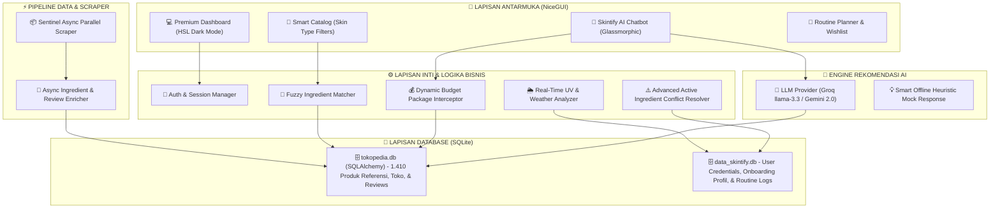

# 🌸 Konsep Aplikasi Skintify-C4 (Advanced System Architecture)

Selamat datang di dokumentasi konsep dan spesifikasi teknis **Skintify-C4**. Dokumen ini dirancang sebagai acuan arsitektur utama untuk pengembang, penguji, dan dosen penguji untuk memahami cara kerja sistem rekomendasi skincare cerdas kami secara menyeluruh.

---

## 📊 1. Diagram Arsitektur Sistem

Berikut adalah arsitektur modular **Skintify-C4** yang menghubungkan antarmuka NiceGUI, Database SQLite Relasional, Mesin Fuzzy Matching, Asynchronous Scraper, dan API Large Language Model (Gemini/Groq):

---

## 🧴 2. Fitur Utama & Keunggulan Premium

Aplikasi **Skintify-C4** dibangun di atas landasan desktop-first dengan desain estetika modern. Fitur-fitur unggulan kami meliputi:

### A. 💰 Dynamic Budget Package Solver (Baru!)
*   **Masalah**: Pengguna seringkali bingung memilih kombinasi skincare dasar yang ramah di kantong karena AI konvensional tidak tahu harga real-time database.
*   **Solusi**: Interseptor budget real-time di chatbot. Saat pengguna memasukkan budget (misal: *"paket skincare di bawah 100rb"*), sistem langsung menghitung kombinasi termurah dari kategori esensial (**Cleanser + Moisturizer + Sunscreen**) dari 1.410 produk di database dan menjamin total harganya **100% di bawah budget**.

### B. 🔬 Advanced Active Ingredient Conflict Resolver
*   **Masalah**: Pencampuran bahan aktif kosmetik yang salah dapat merusak skin barrier (misalnya mencampurkan *Retinol* dengan *AHA/BHA* atau *Vitamin C* dalam waktu bersamaan).
*   **Solusi**: Aplikasi kami memindai bahan aktif dari produk yang dimasukkan pengguna ke **Routine Planner** secara real-time dan memberikan peringatan konflik bahan aktif berat demi keamanan kulit pengguna.

### C. 🌪️ Asynchronous Multi-Worker Sentinel Scraper
*   Menggunakan teknik concurrency modern (`asyncio` dan `aiohttp`) di mana sistem memicu **5 concurrent worker** secara paralel untuk mengambil detail bahan aktif kosmetik dan review asli secara asinkron dari API Sociolla.
*   Mampu melakukan *enrichment* **1.410 produk dalam hitungan menit** tanpa membekukan CPU.

### D. 🌦️ Real-Time Weather-Adaptive Recommendation
*   Membaca data cuaca (kelembapan udara, suhu, indeks UV) wilayah geografis pengguna secara live untuk mengadaptasi anjuran penggunaan sunscreen dan kelembapan tekstur gel/cream.

---

## 💾 3. Spesifikasi Skema Database SQLite

Aplikasi menggunakan pendekatan **Double-Database Isolation** untuk mengisolasi data operasional internal pengguna dengan data produk katalog referensi yang besar.

### A. Database Katalog (`tokopedia.db`)
Tabel utama dikelola menggunakan **SQLAlchemy ORM** dengan relasi sebagai berikut:

#### 1. Tabel `sociolla_referensi`
Menyimpan katalog produk kosmetik yang sudah di-enrich secara asinkron.
*   `id` (INTEGER, Primary Key)
*   `slug` (VARCHAR, Unique)
*   `brand` (VARCHAR)
*   `product_name` (VARCHAR)
*   `category` (VARCHAR) - *Serum, Moisturizer, Sunscreen, Toner, Cleanser, dll.*
*   `rating_sociolla` (FLOAT)
*   `total_reviews` (INTEGER)
*   `min_price` (FLOAT)
*   `image_url` (TEXT)
*   `ingredients` (TEXT) - *Daftar bahan aktif lengkap dipisahkan koma untuk Fuzzy Match.*
*   `reviews` (TEXT) - *Ulasan asli real-user dalam format JSON untuk analisis chatbot.*

#### 2. Tabel `produk` (Marketplace mapping)
*   `id` (INTEGER, Primary Key)
*   `referensi_id` (INTEGER, ForeignKey `sociolla_referensi.id`)
*   `nama` (VARCHAR) - *Nama produk di Tokopedia/Lazada.*
*   `harga` (FLOAT) - *Harga live pembanding.*
*   `platform` (VARCHAR) - *Tokopedia / Lazada.*
*   `link_produk` (TEXT)

---

## 📈 4. Rencana Pengembangan Selanjutnya (Roadmap)

> [!TIP]
> Rencana pengembangan ini dirancang untuk pengembangan jangka panjang pasca ETS/UAS:

1.  **AI Skin Scanner Integration**: Mengintegrasikan kamera web/HP untuk memindai wajah pengguna secara langsung, mendeteksi kerutan/jerawat, dan mencocokkannya ke database produk.
2.  **Universal Barcode Scanner**: Memungkinkan pengguna melakukan scan barcode botol skincare fisik di toko kosmetik untuk memunculkan bahan aktif dan deteksi alergi secara instan.
3.  **Community Hub**: Fitur berbagi rutinitas skincare buatan pengguna ke feed publik kelompok lain.

---
Dokumen ini disusun dengan penuh cinta oleh **Tim C4 - Skintify Desktop**. Selamat menikmati kemudahan merawat kulit dengan cara cerdas! 🌸✨
