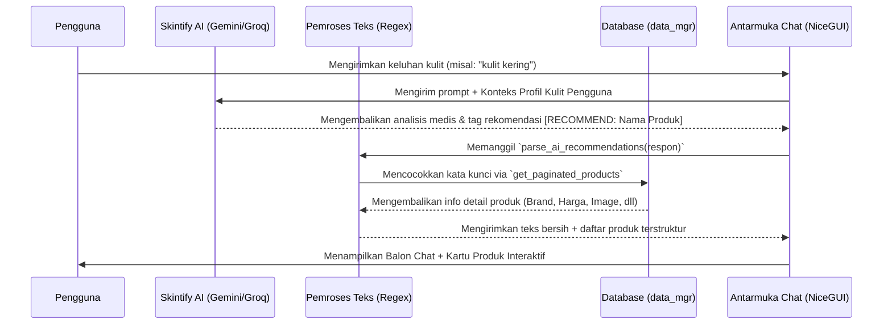

# Integrasi Rekomendasi Produk Interaktif Skintify AI Chatbot

Dokumen ini menjelaskan rancangan arsitektur dan detail implementasi fitur rekomendasi produk interaktif yang menghubungkan **Skintify AI Chatbot** secara langsung dengan database internal produk Skintify.

---

## 🧬 Alur Arsitektur Integrasi

Sistem bekerja secara otomatis melalui alur reaktif berikut:



---

## 🛠️ Fitur-Fitur Utama yang Diimplementasikan

### 1. Instruksi Sistem Rekomendasi (System Instructions)
Kami memperbarui instruksi sistem (baik untuk model **Gemini** maupun **Groq**) agar secara cerdas menyematkan tag khusus `[RECOMMEND: Nama Lengkap Produk]` di akhir respon setiap kali merekomendasikan produk skincare nyata dari brand populer (misal: *Skintific*, *Cosrx*, *Wardah*, dll).

> [!NOTE]
> Kami juga memperbarui sistem **Offline / Simulasi Medis** agar secara heuristik menghasilkan rekomendasi produk nyata yang sesuai dengan keluhan pengguna (seperti jerawat, kulit kering, dan berminyak).

### 2. Regex Parsing & Pembersihan Teks (`parse_ai_recommendations`)
Sebuah fungsi parser pintar diimplementasikan untuk memindai tag rekomendasi secara real-time:
- Memisahkan daftar produk terkompilasi.
- Menghapus tag dari teks respon mentah agar antarmuka balon percakapan tetap **bersih dan elegan** dari tag kode developer.
- Menghubungi `data_mgr.get_paginated_products` untuk mengambil representasi database yang valid (termasuk brand, harga termurah, gambar produk, dan ID referensi).

### 3. Kartu Produk Interaktif yang Premium (Premium Glassmorphic Product Cards)
Jika AI mendeteksi rekomendasi produk, sistem akan menggambar kartu produk berdesain premium tepat di bawah balon chat dengan menyajikan:
- **Foto Produk** (atau ikon kategori berdesain modern jika kosong).
- **Brand & Nama Lengkap Produk** yang rapi.
- **Harga Termurah** dari pencarian pasar lokal.
- **Tiga Tombol Interaksi Cepat**:
  1. **Bandingkan Harga ↗**: Menyimpan query ke session penyimpanan dan mengalihkan pengguna ke halaman `/search`, yang secara instan akan memicu perbandingan harga Lazada vs Tokopedia.
  2. **+ Planner**: Membuka dialog modifikasi cerdas untuk menambahkan produk ke routine planner.
  3. **❤️ (Favorit/Wishlist)**: Tombol berbentuk hati warna pink untuk menambahkan produk langsung ke Wishlist secara instan.

### 4. Penambahan Cepat ke Routine Planner
Menggunakan dialog interaktif NiceGUI (`ui.dialog`), pengguna dapat:
- Melihat daftar rutinitas yang saat ini dimiliki (misal: *Rutin Pagi*, *Rutin Malam*).
- Menambahkan produk langsung ke rutinitas tersebut hanya dengan **satu kali klik** (memanggil `RoutineService.add_item_to_routine`).
- Membuat rutinitas baru secara instan jika belum memilikinya, kemudian langsung menautkan produk ke rutinitas baru tersebut secara dinamis.

### 5. Penambahan Instan ke Wishlist (Sistem Sinkronisasi Persisten)
Sistem sekarang secara dinamis memanipulasi `state.wishlist` (yang tersinkronisasi secara persisten dengan `app.storage.user['wishlist']` pada modul wishlist Syaqila) melalui fungsi `add_to_wishlist(prod)`:
- Melakukan verifikasi duplikasi berdasarkan slug produk sehingga satu produk yang sama tidak dapat dimasukkan dua kali.
- Menyimpan representasi data produk lengkap (Brand, Nama, Kategori, Harga, Image, Rating) sehingga halaman wishlist dapat langsung menampilkannya secara instan dengan visual premium.

### 6. Pencocokan Cerdas Berbasis Fuzzy Logic (Sequence & Token Similarity Ratio)
Untuk mengatasi kelemahan pencarian teks kaku (strict substring), sistem pencarian `DataManager` kini dilengkapi dengan algoritma **Fuzzy Logic hibrida** yang dinamis:
- **Token Intersection**: Memotong kata kunci pencarian menjadi kata-kata individual dan melakukan pencocokan irisan token (tidak terikat urutan kata).
- **Gestalt Pattern Matching (`difflib.SequenceMatcher`)**: Menghitung rasio kemiripan urutan karakter asli dengan database secara real-time.
- **Ambang Batas Moderat (Threshold >= 0.65)**: Menjaga pencarian tetap fleksibel terhadap salah ketik (typo) atau penyingkatan nama produk, tanpa memaksakan hasil yang meleset jauh.
- **Prioritas Produk Kustom Admin (Manual Products)**: Sesuai rancangan tim, produk yang dibuat manual oleh Admin (`is_manual = True`) otomatis mendapatkan bonus bobot skor kemiripan (`+0.15`) sehingga langsung naik ke urutan prioritas teratas jika memiliki kemiripan nama dengan rekomendasi AI.

### 7. Panduan Interaksi Cerdas (Guided Conversation UX Cards)
Untuk memandu pengguna yang bingung harus berbuat apa atau tidak tahu bagaimana menanyakan kebutuhan spesifik mereka ke AI, kami menyematkan **Quick Suggestion Prompt Cards (ChatGPT/Gemini Style)** yang dapat diklik langsung di awal obrolan:
- **💰 Budget-Oriented Guide**: *"Punya Budget Rp100k, pilih produk apa?"* – Secara otomatis menginstruksikan AI untuk mencari dan merancang kombinasi produk terbaik dari database yang harganya di bawah Rp 100.000.
- **🔴 Skin Issues Target**: *"Kulit Kemerahan & Jerawat, baiknya gimana?"* – Memandu pengguna mendapatkan penanganan jerawat meradang dan mencocokkan bahan aktif yang menenangkan dari database.
- **✨ Brightening Guide**: *"Rekomendasi Serum Mencerahkan Kulit Kusam"* – Memandu pencarian serum yang efektif menghilangkan noda hitam dari database produk.
- **🛡️ Skin Barrier Repair**: *"Cara Memperbaiki Skin Barrier yang Rusak"* – Memberikan panduan darurat untuk kulit kering mengelupas beserta kecocokan pelembap dari database.

---

## 💻 Cuplikan Kode Utama (Core Implementation)

### Kode Parser Rekomendasi:
```python
def parse_ai_recommendations(text: str) -> tuple:
    recommended_products = []
    pattern = r"\[RECOMMEND:\s*(.*?)\]"
    matches = re.findall(pattern, text)
    
    cleaned_text = re.sub(pattern, "", text).strip()
    cleaned_text = re.sub(r"\n\s*\n\s*$", "", cleaned_text).strip()
    
    for prod_name in matches:
        prod_name = prod_name.strip()
        if not prod_name:
            continue
            
        res = data_mgr.get_paginated_products(keyword=prod_name, items_per_page=1)
        items = res.get("items", [])
        if items:
            recommended_products.append(items[0])
            
    return cleaned_text, recommended_products
```

### Penambahan ke Planner dari DB:
```python
async def add_item_to_r(r_id, r_name, prod):
    with SessionLocal() as session_write:
        from app.database.models import Produk
        matched_produk = session_write.query(Produk).filter_by(referensi_id=prod['id']).first()
        if matched_produk:
            RoutineService.add_item_to_routine(session_write, r_id, product_id=matched_produk.id)
        else:
            prod_name = f"{prod['brand']} {prod['product_name']}".strip()
            notes = f"IMAGE:{prod.get('image_url', '')}"
            RoutineService.add_item_to_routine(session_write, r_id, custom_name=prod_name, notes=notes)
    ui.notify(f"{prod.get('product_name')} ditambahkan ke '{r_name}'! 🧴", color='positive')
```

### Penambahan ke Wishlist:
```python
def add_to_wishlist(prod):
    wishlist = state.wishlist or []
    if any(p.get('slug') == prod.get('slug') for p in wishlist):
        ui.notify('Produk sudah ada di Wishlist Anda! ❤️', color='warning', icon='favorite')
        return
        
    wishlist.append(prod)
    state.wishlist = wishlist
    ui.notify('Berhasil ditambahkan ke Wishlist! ❤️', color='pink', icon='favorite')
```

---

> [!TIP]
> Semua modifikasi telah lolos uji kompilasi statis (`py_compile`) tanpa error sintaksis. Integrasi ini membuat chatbot Skintify terasa seperti aplikasi asisten kecantikan komersial kelas atas!
