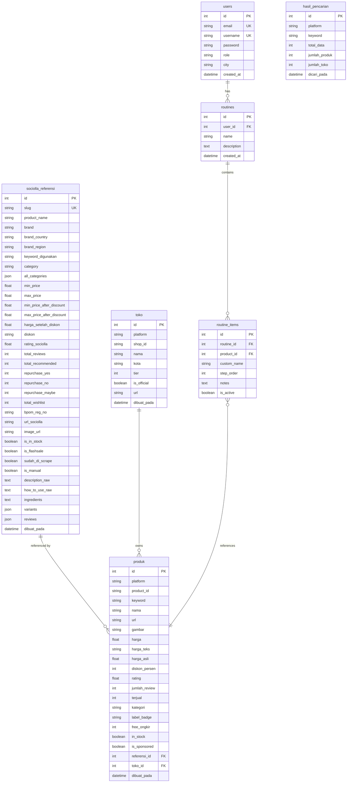

# 🔬 Spesifikasi API & Skema Database SQLite (Skintify-C4)

Dokumen ini mendokumentasikan desain database relasional SQLite (dikelola via SQLAlchemy ORM) dan kontrak API scraper marketplace internal/eksternal yang digunakan oleh aplikasi **Skintify-C4**.

---

## 💾 1. Skema Database Relasional (SQLite)

Database utama disimpan pada file `tokopedia.db` di dalam direktori proyek. Terdapat 7 tabel utama yang saling berelasi secara terstruktur.



### 📋 Deskripsi Kolom Detail & Constraint Tabel

#### A. Tabel `users`
Menyimpan profil pengguna aplikasi beserta preferensi kota untuk integrasi cuaca real-time.
* `id` (INTEGER, Primary Key): ID Unik Auto-increment.
* `email` (VARCHAR(255), Unique, Not Null): Surat elektronik autentikasi.
* `username` (VARCHAR(100), Unique, Not Null): Nama pengguna pengenal.
* `password` (VARCHAR(255), Not Null): Hash sandi terenkripsi.
* `role` (VARCHAR(20), Not Null, Default: 'user'): Hak akses (`'user'` atau `'admin'`).
* `city` (VARCHAR(100), Nullable): Nama Kota untuk integrasi API cuaca eksternal.

#### B. Tabel `routines` & `routine_items`
Mengelola rutinitas skincare kustom harian pengguna (Morning/Night Routine).
* `routine_items.product_id` memiliki Foreign Key ke `produk.id` (menghubungkan item rutin ke marketplace partner terverifikasi) dengan opsi `custom_name` sebagai fallback jika pengguna menggunakan produk kustom di luar katalog database.

#### C. Tabel `toko`
Registry toko unified lintas marketplace platform.
* `uq_toko_platform_shopid` (Composite Unique Constraint): Menjamin kombinasi kolom `platform` + `shop_id` unik demi menghindari duplikasi data ketika import toko lintas e-commerce.

#### D. Tabel `produk`
Katalog harga e-commerce terupdate untuk pembanding harga real-time.
* `referensi_id` (ForeignKey ke `sociolla_referensi.id`): Menghubungkan produk Tokopedia/Lazada ke katalog referensi kandungan kosmetik utama.
* `toko_id` (ForeignKey ke `toko.id`): Pemilik lapak resmi produk bersangkutan.
* `uq_produk_platform_keyword` (Composite Unique Constraint): Mencegah duplikasi data pencarian untuk platform yang sama dengan kata kunci pencarian yang identik.

#### E. Tabel `sociolla_referensi`
*Single Source of Truth* untuk detail bahan aktif, klaim, ulasan pelanggan asli, dan BPOM RI.
* `ingredients` (TEXT): Daftar lengkap bahan kimia penyusun dipisahkan koma untuk parsing kecerdasan buatan.
* `reviews` (JSON): Kumpulan ulasan terstruktur berisi nama pengguna, rating bintang, dan ulasan tertulis.

---

## 🔌 2. Spesifikasi API & Sentinel Web Scraper

Aplikasi menggunakan dua e-commerce scraper adaptif tingkat lanjut yang memotong proteksi bypass secara efisien tanpa memerlukan login session.

### 🟢 A. Tokopedia Live Search GraphQL API
Menggunakan query terstruktur langsung ke service GQL Tokopedia Search.

* **Endpoint URL**: `https://gql.tokopedia.com/graphql/SearchProductV5Query`
* **Metode**: `POST`
* **Headers Wajib**:
  ```http
  Content-Type: application/json
  x-source: tokopedia-lite
  origin: https://www.tokopedia.com
  referer: https://www.tokopedia.com/search
  User-Agent: Mozilla/5.0 (Windows NT 10.0; Win64; x64)
  ```
* **Payload GraphQL (SearchProductV5)**:
  ```json
  {
    "operationName": "SearchProductV5Query",
    "variables": {
      "params": "q=skintific%20serum&source=search&device=desktop&page=1&rows=5"
    },
    "query": "query SearchProductV5Query($params: String!) { ace_search_product_v5(params: $params) { data { products { id name price priceInt url imageUrl rating countReview shop { id name city isOfficial tier } } } } }"
  }
  ```

### 🔵 B. Lazada Catalog Live Scraper
Melakukan fetching secara asinkron terhadap HTML catalog e-commerce Lazada Indonesia, mem-parsing script tag bermuatan data JSON terstruktur untuk mengekstrak:
* `item_id`, `name`, `price`, `image_url`
* `rating_score`, `review_count`, `sold_count`
* Lapak Seller (`shop_id`, `shop_name`, `location`, `LazMall_status`)

---

## 🔬 3. Mesin Rekomendasi Kandungan & Deteksi Konflik (AI Engine)

Penganalisis bahan kimia skincare mandiri menggunakan basis data berkecepatan tinggi secara offline:
* **Comedogenic Index Evaluation**: Menganalisis nilai kerawanan penyumbatan pori-pori skala `0 - 5`.
* **Irritancy Hazard Evaluation**: Menghitung beban iritasi untuk kulit sensitif skala `0 - 5`.
* **Routine Safety Engine**:
  * Mendeteksi tabrakan bahan aktif terlarang secara asinkron seperti **Retinol + AHA/BHA** (risiko iritasi parah & kerusakan barrier) atau **Vitamin C + AHA/BHA** (ketidakseimbangan pH kulit).
