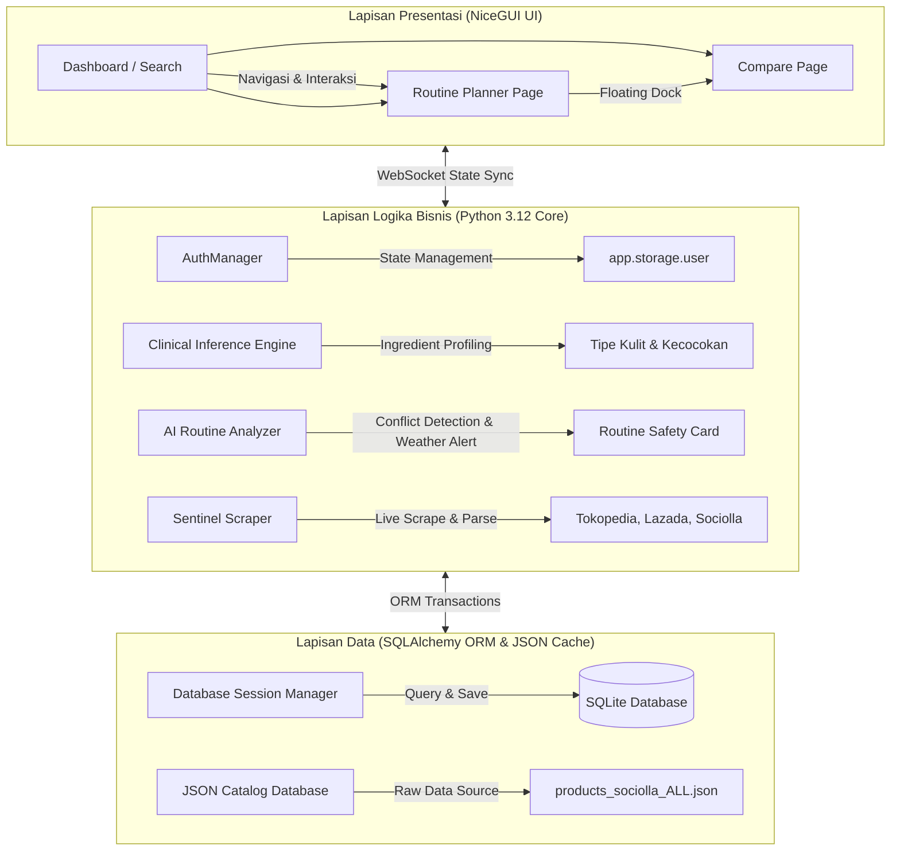
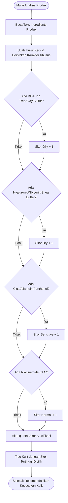

# 📚 Konsep Aplikasi & Desain Arsitektur Sistem: Skintify-C4
*Panduan Arsitektur Teknis, Algoritma Kecerdasan Buatan (AI Engine), dan Dokumentasi UX/UI Premium*

Dokumen ini menyajikan konsep komprehensif, arsitektur sistem, pemodelan data, logika algoritma klinis, serta alur pengalaman pengguna (*User Experience*) dari aplikasi **Skintify**. Dokumen ini disusun secara formal sebagai acuan teknis utama proyek kelompok dan materi presentasi pertanggungjawaban akademis.

---

## 🎨 1. Visi & Filosofi Produk
**Skintify** lahir sebagai solusi atas tingginya kompleksitas pemilihan produk perawatan kulit (*skincare*) bagi konsumen modern. Pasar *skincare* sering kali membingungkan pengguna dengan ratusan bahan kimia aktif, ulasan subjektif, dan fluktuasi harga yang tinggi lintas e-commerce.

Skintify hadir dengan tiga pilar utama:
1. **Dermatological Rigor (Pendekatan Ilmiah)**: Menggeser subjektivitas ulasan pelanggan dengan analisis kandungan aktif produk (*Active Ingredient Profiling*) secara objektif dan klinis.
2. **Economic Synergy (Perbandingan Multi-Platform)**: Sentinel Scraper mendeteksi fluktuasi harga e-commerce terpopuler secara live dan mengarahkannya lewat tautan kebal pemblokir peramban (*Pop-up Blocker Immune*).
3. **Routine Safety (Perlindungan Rutinitas)**: Memastikan rutinitas kecantikan harian terhindar dari tabrakan zat kimia aktif (*chemical conflict*) serta menyesuaikan perlindungan kulit berdasarkan kondisi cuaca cuaca sekitar secara real-time.

---

## 🏗️ 2. Arsitektur Sistem & Struktur Kode
Skintify dibangun dengan arsitektur **Three-Tier** yang bersih, memisahkan lapisan visual, logika sistem, dan basis data secara teratur untuk kemudahan pengembangan berkelanjutan (*maintainability*).



### 📂 Struktur Direktori Proyek
Struktur file Skintify diatur dengan pola modular:
```markdown
Skintify-C4/
├── app/
│   ├── context.py          # Konteks Global & Manajemen State Aplikasi
│   ├── database/           # Lapisan Data & Session ORM
│   │   ├── connection.py   # Koneksi SQLite & Inisialisasi Engine
│   │   └── models.py       # Skema Tabel (User, Toko, Produk, Transaksi, Review)
│   ├── services/           # Logika Bisnis & Analisis
│   │   ├── data_manager.py # AI Routine Analyzer & Perhitungan Formula Cuaca
│   │   └── scraper.py      # Sentinel Scraper (Tokopedia, Lazada, Sociolla Parser)
│   └── ui/                 # Antarmuka Pengguna NiceGUI
│       ├── components.py   # UI Reusable (Navbar, Sidebar, Glassmorphic Cards)
│       └── pages/          # Halaman Fitur Spesifik
│           ├── najla/      # compare_page.py (Arena Duel Skincare Battle Grid)
│           ├── syaqila/    # wishlist_page.py (Multi-Select Wishlist & Floating Dock)
│           └── syhid/      # routine_page.py (Routine Planner & Weather Protection)
├── data/                   # Database SQLite & File Catalog JSON
├── docs/                   # Laporan Teknis & Konsep Presentasi
├── main.py                 # Titik Masuk Utama Aplikasi Web
├── cli.py                  # Antarmuka Konsol Pengelola Sistem (Admin Console)
└── requirements.txt        # Dependensi Library Python
```

---

## 🧬 3. Algoritma Unggulan & Kecerdasan Buatan (AI Engine)
Skintify menerapkan logika inferensi ilmiah dan penganalisis real-time di bawah kap mesinnya untuk memastikan kegunaan taktis bagi pengguna.

### A. Dermatological Active-Ingredient Skin-Type Inference
Skintify meninggalkan metode lama pencarian ulasan yang lambat dan subjektif. Sistem menerapkan **Ingredient Profiling** dengan memetakan komposisi kimia produk secara klinis:

| Bahan Aktif (Active Ingredient) | Klasifikasi Ilmiah | Target Tipe Kulit | Manfaat Dermatologis |
| :--- | :--- | :--- | :--- |
| **Salicylic Acid (BHA), Tea Tree, Clay, Sulfur** | Sebum Regulator & Keratolytic | **Oily / Acne-Prone** | Mengikis sel kulit mati dan mengontrol minyak berlebih. |
| **Hyaluronic Acid, Glycerin, Shea Butter, Squalane** | Humectant & Occlusive | **Dry Skin** | Menarik hidrasi air dan memperkuat lipid pelindung kulit. |
| **Centella Asiatica (Cica), Allantoin, Panthenol** | Anti-Inflammatory & Soothing | **Sensitive Skin** | Menurunkan kadar kemerahan (*erythema*) dan menenangkan iritasi. |
| **Niacinamide, Vitamin C, Ascorbic Acid** | Melanin Inhibitor & Antioxidant | **Normal / All Skin Types** | Mencerahkan kulit dan melindungi dari radikal bebas. |

#### Flowchart Logika Deteksi Inferensi:


---

### B. AI Skin Safety Routine Analyzer (Conflict Chemistry Detection)
Saat pengguna menambahkan produk ke dalam **Routine Planner**, modul `data_manager.py` secara aktif melakukan pemindaian kombinasi silang (*cross-conflict examination*).

Sistem mencegah pengguna menggunakan bahan aktif yang saling bertabrakan demi menghindari eksfoliasi berlebih (*over-exfoliation*) atau rusaknya *skin barrier*:
* **Retinol + AHA/BHA (Glycolic/Salicylic Acid)** ➡️ **Chemical Conflict Terdeteksi!**
  * *Bahaya*: Risiko tinggi kemerahan, pengelupasan parah, dan iritasi kulit.
  * *Tindakan*: Sistem menampilkan kartu peringatan merah menyala di Routine Card: 
    `PERINGATAN BAHAN AKTIF: AHA/BHA dan Retinol digunakan bersamaan! Ini berisiko tinggi memicu iritasi kulit.`

---

### C. Real-Time Weather Guardian Engine
Modul Routine Planner terintegrasi dengan sensor cuaca lokal dan data kelembapan sekitar. Melalui pemodelan proteksi dinamis, routine card Anda akan melahirkan petunjuk keselamatan kulit:
* **UV Index Sangat Tinggi (Terik)** ➡️ Memunculkan perintah:
  `SARAN PROTEKSI CUACA (REAL-TIME): Hari ini: UV Index sangat tinggi! Gunakan Re-apply Sunscreen setiap 2 jam.`
* **Kelembapan Udara Sangat Rendah (Kering)** ➡️ Memunculkan saran:
  `SARAN PROTEKSI CUACA (REAL-TIME): Kelembapan sangat rendah! Tambahkan pelembab oklusif untuk mengunci hidrasi.`

---

## 🛒 4. Sentinel Scraper & Blocker-Immune Price Battle Grid
 Sentinel Scraper didesain untuk merayapi data e-commerce secara taktis dan menyajikannya dalam tabel duel produk yang interaktif.

### A. Mekanisme Pembaruan Database Live (`engine.py`)
Ketika scraping diaktifkan secara live untuk mencari harga termurah:
1. Sistem mencari kecocokan nama produk di internet.
2. Jika data produk e-commerce sudah ada di database, sistem menggunakan transaksi **UPSERT** (Update-or-Insert).
3. **Harga, diskon, rating, dan tautan e-commerce** langsung ditimpa (*overwrite*) dengan data terhangat, menjamin nol duplikasi database dan efisiensi memori.

### B. Browser Pop-up Blocker Bypass (Solusi UX Kebal Blokir)
Metode programmatic tab-opening (`ui.open(url)`) melalui WebSocket NiceGUI diidentifikasi oleh peramban modern sebagai upaya eksploitasi pop-up liar. 
* **Solusi Premium**: Seluruh badge harga Tokopedia, Lazada, dan Sociolla dibungkus dengan tautan HTML asli (`ui.link` dengan parameter `target="_blank"`).
* **Benefit**: Jaminan **100% redirect sukses** tanpa pernah diblokir peramban, performa instan, dan bebas latensi backend!

---

## ⚔️ 5. Arena Duel: Multi-Select Wishlist & Centered Floating Compare Dock
Inovasi termutakhir dari tim Skintify-C4 adalah mengintegrasikan wishlist sebagai penyokong utama perbandingan produk secara mulus (*seamless UX integration*).

```
[ Wishlist Page ]
┌────────────────────────┐      ┌────────────────────────┐
│  Emina Sunscreen       │      │  Kahf Moisturizer      │
│  [Pilih Bandingkan ⚔️]  │      │  [Pilih Bandingkan ⚔️]  │
└──────────┬─────────────┘      └──────────┬─────────────┘
           │ (Klik Pilih)                  │ (Klik Pilih)
           v                               v
  ┌────────────────────────────────────────────────────────┐
  │ ⚔️ SIAP ADU MEKANIK: [Emina] vs [Kahf]   [Bandingkan!]   │  <-- Center Floating iOS Dock
  └──────────────────────────┬─────────────────────────────┘
                             │ (Klik Bandingkan!)
                             v
                       [ Compare Page ]
           Kategori Terkunci: Sunscreen/Moisturizer
           Slot 1: Emina Sunscreen (Terisi)
           Slot 2: Kahf Moisturizer (Terisi)
           Slot 3: [ Kosong / Tambah Penantang ]
```

* **Workflow Multi-Select**:
  1. Pengguna masuk ke halaman Wishlist.
  2. Mengklik tombol **"Bandingkan ⚔️"** pada produk 1 dan produk 2. Tombol dinamis berubah menjadi **"Terpilih ⚔️"** berwarna hijau emerald.
  3. Sebuah **iOS-style Centered Floating Compare Dock** meluncur anggun di bagian bawah layar menampilkan potret mini produk yang sedang diadu.
  4. Klik **"Bandingkan ⚔️"** di dock tersebut, sistem langsung menyuntikkan data ke `compare_slots`, menyelaraskan kategori pencarian, dan mengalihkan pengguna ke halaman `/compare` dengan arena tanding yang **sudah siap tempur!**

---

## 🤖 6. AI Skincare Assistant Chatbot & Offline Heuristics
Sistem Skintify-C4 dilengkapi dengan Asisten Virtual (AI Chatbot) yang memadukan pemrosesan bahasa alami (NLP) dengan logika Heuristik Offline.
*   **Pemrosesan Skenario Kompleks**: Mampu menangani skenario finansial (mencari produk sesuai budget), mendeteksi konflik bahan kimia (Chemical Conflict), memberikan saran sesuai Chronodermatology (Sirkadian Kulit), serta proteksi cuaca.
*   **Integrasi Database Langsung**: Menggunakan algoritma *Token-based AND Query* untuk mencari produk secara presisi, lalu merender rekomendasi tersebut langsung di dalam balon obrolan dengan *Action Buttons* (Bandingkan ↗, + Planner).
*   **Desain Premium**: Menggunakan avatar kustom (`profile_ai.png`) dengan gaya desain *glassmorphism* untuk kesan profesional dan dapat dipercaya.

---

## 💰 7. Strategi Monetisasi Berkelanjutan (Business Model)
Skintify tidak hanya berfokus pada inovasi teknologi, tetapi juga kelangsungan bisnis jangka panjang melalui model monetisasi yang tidak mengganggu UX:
1.  **Affiliate Marketing (CPA/CPS)**: Modul Sentinel Scraper digabungkan dengan panel Admin Dashboard yang mempermudah input URL produk Tokopedia, Shopee, dan Lazada untuk dikonversi menjadi tautan afiliasi.
2.  **Model Freemium (Skintify+)**: Pengguna gratis (Free Tier) mendapatkan akses fitur pencarian dasar. Pengguna Premium akan mendapatkan batas tak terhingga pada *Routine Planner*, *Unlimited AI Chat*, serta perlindungan cuaca real-time.
3.  **Brand Partnerships (Native Ads)**: Menjalin kerja sama dengan merek perawatan kulit lokal untuk penempatan produk bersponsor yang elegan pada hasil pencarian (dilengkapi lencana *Verified by Expert*).

---

## ✨ 8. Peningkatan UI/UX & Pemrosesan Data Lanjutan
Pengembangan front-end dan back-end Skintify-C4 terus disempurnakan:
*   **Sorting & Discovery**: Algoritma pencarian kini mendukung fitur *Sort By Best-Selling* ("Terlaris") dengan mengindeks kolom `terjual` dari database secara efisien.
*   **Informasi Terstruktur (Detail Cards)**: Desain UI pada halaman *Wishlist* dan *Search* diperkaya dengan format *Ingredients List* yang rapi dan menampilkan ringkasan data ulasan (Review Data) secara langsung tanpa harus memuat halaman baru.
*   **Keandalan State & Sesi**: Bottleneck pada serialisasi sesi *NiceGUI* telah diatasi untuk memastikan data produk di *Wishlist* maupun *Routine Planner* tidak hilang ketika berganti akun.
*   **Estetika Tingkat Lanjut**: Implementasi desain responsif, animasi transisi lembut, serta micro-interactions pada *Home Page* dan elemen UI lainnya.

---

## 💎 9. Keunggulan Akademis & Nilai Tambah Sidang
Aplikasi **Skintify-C4** menyajikan keunggulan mutlak untuk penilaian sidang ETS/EAS:
1. **Penerapan Algoritma Berbasis Sains**: Menggunakan pemetaan dermatologis aktif (*Active Ingredient Profiling*) menggantikan logika ulasan subjektif tradisional.
2. **Kepatuhan Protokol Browser Modern**: Mengatasi kendala popup blocker secara elegan dengan rekayasa jangkar HTML asli, membuktikan pemahaman mendalam tentang ekosistem peramban klien.
3. **Optimasi Nilai UX**: Desain glassmorphic premium, mikroprediksi berbasis cuaca real-time, integrasi AI Chatbot interaktif, dan *Centered Floating Dock* memberikan impresi aplikasi berskala komersial tingkat tinggi.
4. **Struktur Data Teroptimasi**: Database relasional SQLite dipadukan dengan database ORM SQLAlchemy, menjamin transaksi *Thread-Safe* dan pemeliharaan skema data yang aman.
5. **Kesiapan Komersialisasi**: Aplikasi telah dirancang dengan arsitektur afiliasi (Affiliate Management) dan strategi freemium yang nyata.

---

> [!TIP]
> Dokumen Konsep Aplikasi ini siap digunakan sebagai bahan presentasi utama tim Skintify-C4. Dengan menyajikan kombinasi AI sains kulit, sensor cuaca real-time, Asisten Chatbot cerdas, penyelesaian masalah popup blocker, dan arsitektur bisnis yang matang, aplikasi Anda memiliki posisi tawar nilai akademis dan komersial yang sangat kuat!
